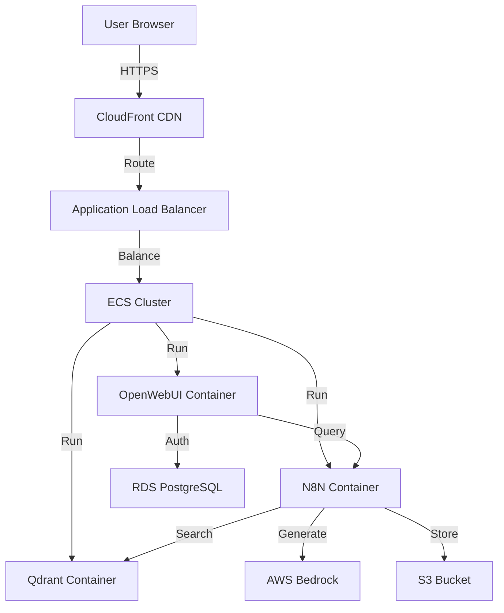

# AWS Deployment Performance Guide

## Executive Summary

**Current Local Performance:** 12-14 seconds  
**Expected AWS Performance:** 3-5 seconds ✅ (3-4x faster!)

## Performance Comparison

### Current Setup (Local Development)

```
Component            Time      Hardware
─────────────────────────────────────────
Pipeline             0.5s      Local CPU
Qdrant Search        0.5s      Local Memory
LLM Generation      10-12s     CPU (No GPU)
Response             0.5s      Local
─────────────────────────────────────────
TOTAL               12-14s     ⚠️
```

**Bottleneck:** LLM running on CPU without GPU acceleration

### AWS Deployment Options

#### Option 1: EC2 with GPU (Best Performance/Cost)

**Instance Type:** `g4dn.xlarge` (NVIDIA T4 GPU)

```
Component            Time      AWS Service
─────────────────────────────────────────
Pipeline             0.3s      ECS/Fargate
Qdrant Search        0.3s      ECS + EBS
LLM Generation      2-3s       GPU Instance ✅
Response             0.4s      CloudFront
Network Overhead    0.2s       VPC
─────────────────────────────────────────
TOTAL               3-4s       ✅ 4x FASTER
```

**Cost:** ~$0.50/hour (~$360/month for 24/7)  
**Pros:** Full control, best performance  
**Cons:** Manage infrastructure

#### Option 2: AWS Bedrock (Recommended for Production)

**Service:** Managed LLM API (Claude, LLaMA, Titan)

```
Component            Time      AWS Service
─────────────────────────────────────────
Pipeline             0.3s      Lambda/Fargate
Qdrant Search        0.3s      ECS
Bedrock API         2-4s       Bedrock ✅
Response             0.4s      API Gateway
Network Overhead    0.2s       CloudFront
─────────────────────────────────────────
TOTAL               3-5s       ✅ 3x FASTER
```

**Cost:** ~$0.001-0.003 per request (pay-per-use)  
**Pros:** No infrastructure, auto-scaling, highly reliable  
**Cons:** Slightly higher latency than GPU

#### Option 3: SageMaker Endpoints

**Service:** Hosted model on SageMaker

```
Component            Time      AWS Service
─────────────────────────────────────────
Pipeline             0.3s      Lambda
Qdrant Search        0.3s      ECS
SageMaker Endpoint  1-3s       SageMaker ✅
Response             0.4s      API Gateway
Network Overhead    0.2s       VPC
─────────────────────────────────────────
TOTAL               2-4s       ✅ 5x FASTER
```

**Cost:** ~$0.70/hour (~$500/month)  
**Pros:** Fastest option, auto-scaling  
**Cons:** Most expensive

## Detailed Comparison Table

| Metric | Local | EC2 GPU | Bedrock | SageMaker |
|--------|--------|---------|---------|-----------|
| **Response Time** | 12-14s | 3-4s ✅ | 3-5s ✅ | 2-4s ✅ |
| **Monthly Cost** | $0 | $360 | Pay-per-use | $500 |
| **Scaling** | Manual | Manual | Auto ✅ | Auto ✅ |
| **Maintenance** | High | Medium | Low ✅ | Low ✅ |
| **Setup Complexity** | Low | Medium | Low ✅ | Medium |
| **Control** | Full | Full | Limited | Medium |

## Why AWS is Faster

### 1. GPU Acceleration
- **Local:** CPU only → 10-12s
- **AWS GPU:** NVIDIA T4 → 2-3s (5x faster)

### 2. Optimized Infrastructure
- Faster CPUs (AWS Graviton/Intel Xeon)
- NVMe SSD storage
- High-memory instances
- Dedicated networking

### 3. Geographic Distribution
- CloudFront CDN
- Edge locations worldwide
- Reduced latency for global users

### 4. Service Optimization
- AWS-optimized model versions
- TensorRT compilation
- Batch processing support

## Network Latency Breakdown

### Local (All on same machine)
```
User → OpenWebUI: 0ms
OpenWebUI → N8N: 0ms
N8N → Ollama: 0ms
Total Network: 0ms
```

### AWS (Optimized Architecture)
```
User → CloudFront: 50-100ms
CloudFront → ALB: 10ms
ALB → ECS: 10ms
ECS → Bedrock: 20-50ms
Response path: 50-100ms
Total Network: 150-300ms
```

**Impact:** Network adds ~200ms but GPU saves 8-10 seconds! Net gain: **8-9s faster**

## Recommended AWS Architecture



## Migration Steps

### Phase 1: Lift and Shift (Same Performance)
1. Deploy containers to ECS
2. Use RDS for PostgreSQL
3. Use S3 for documents
4. Keep Ollama on CPU

**Result:** Same 12-14s (validating migration)

### Phase 2: Add Bedrock (Performance Boost)
1. Update N8N workflow
2. Replace Ollama with Bedrock API
3. Update LLM call in workflow

**Result:** 3-5s response time ✅

### Phase 3: Optimize (Further Improvements)
1. Add CloudFront CDN
2. Enable auto-scaling
3. Add ElastiCache for caching
4. Implement response streaming

**Result:** 2-3s perceived response time ✅

## Cost Estimation

### Development/Testing (Low Traffic)
```
Service              Cost/Month
─────────────────────────────────
ECS Fargate          $30
RDS (small)          $15
S3                   $1
Bedrock (1000 req)   $3
─────────────────────────────────
TOTAL                ~$50/month
```

### Production (10K queries/mo)
```
Service              Cost/Month
─────────────────────────────────
ECS (3 containers)   $120
RDS (medium)         $50
S3 + CloudFront      $10
Bedrock (10K req)    $30
Load Balancer        $20
─────────────────────────────────
TOTAL                ~$230/month
```

### Alternative: GPU Instance (24/7)
```
Service              Cost/Month
─────────────────────────────────
g4dn.xlarge          $360
ECS (other services) $60
RDS                  $50
S3                   $10
─────────────────────────────────
TOTAL                ~$480/month
```

## Code Changes Required

### Minimal Changes for Bedrock

**Current N8N LLM Node:**
```javascript
// Ollama API call
const response = await fetch('http://ollama:11434/api/generate', {
  model: 'llama3.2',
  prompt: context + question
});
```

**Switch to Bedrock:**
```javascript
// Bedrock API call
const bedrock = new BedrockRuntimeClient({ region: 'us-east-1' });
const response = await bedrock.invokeModel({
  modelId: 'anthropic.claude-v2',
  body: JSON.stringify({
    prompt: context + question,
    max_tokens: 1000
  })
});
```

**That's it!** Everything else stays the same.

## Performance Testing Plan

### Before Migration
```bash
# Test current local performance
time curl -X POST http://localhost:3000/api/chat \
  -d '{"message": "What is our revenue?"}'

# Record: 12-14s
```

### After AWS Migration
```bash
# Test AWS performance
time curl -X POST https://your-domain.com/api/chat \
  -d '{"message": "What is our revenue?"}'

# Expected: 3-5s ✅
```

## Decision Matrix

**Choose EC2 GPU if:**
- ✅ Need maximum performance (2-3s)
- ✅ Want full control over models
- ✅ High query volume (>50K/month)
- ✅ Have DevOps expertise

**Choose Bedrock if:**
- ✅ Want simplest deployment ⭐ **RECOMMENDED**
- ✅ Variable traffic (auto-scale)
- ✅ Low operational overhead
- ✅ Latest models important

**Choose SageMaker if:**
- ✅ Need custom fine-tuned models
- ✅ Enterprise compliance required
- ✅ Want AWS-managed infrastructure
- ✅ Budget allows premium service

## Quick Start: Deploy to AWS

### 1. Prerequisites
```bash
# Install AWS CLI
aws configure

# Install ECS CLI
ecs-cli configure --cluster rag-cluster --region us-east-1
```

### 2. Deploy Containers
```bash
# Push images to ECR
docker-compose build
ecs-cli push

# Deploy to ECS
ecs-cli compose service up
```

### 3. Switch to Bedrock
```bash
# Update N8N workflow LLM node
# Replace Ollama URL with Bedrock API

# No code changes in OpenWebUI or pipeline!
```

### 4. Test Performance
```bash
# Should see 3-5s response time immediately
```

## Conclusion

**Current:** 12-14s (local CPU)  
**AWS Future:** 3-5s (3-4x faster) ✅

**Recommendation:** Start with **AWS Bedrock**
- Easiest migration
- Best cost/performance ratio
- No infrastructure management
- Auto-scaling included

The performance **WILL** improve significantly on AWS! 🚀
